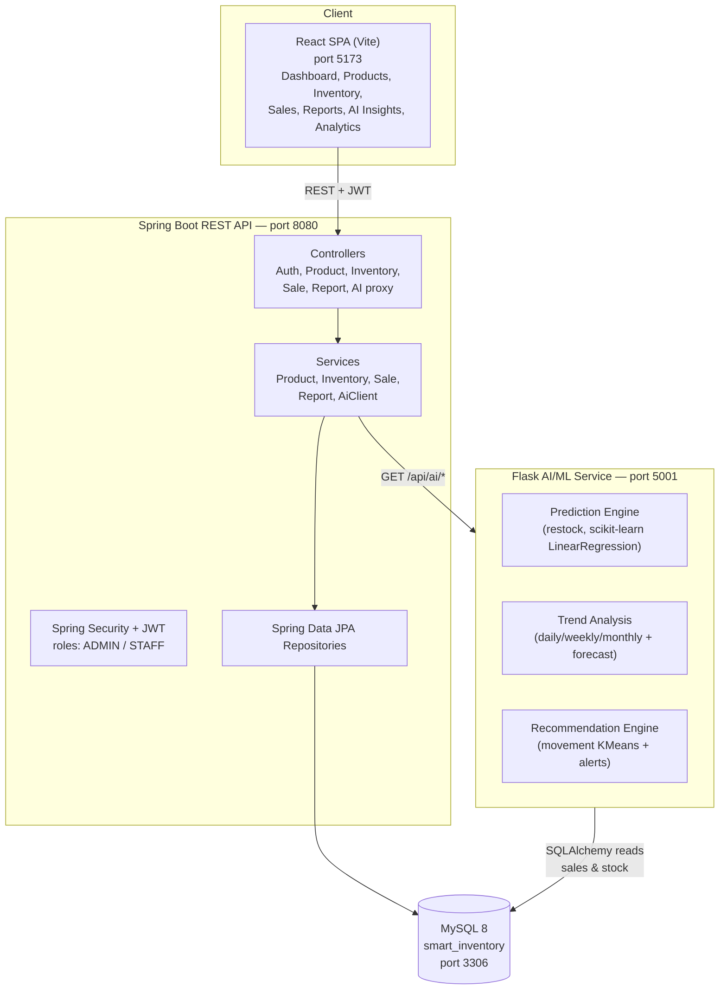

# System Architecture

## High-level component diagram

## Request flow examples

**Login**
1. React posts credentials to `POST /api/auth/login`.
2. Spring Security authenticates against `users` (BCrypt) and returns a JWT.
3. React stores the JWT and attaches it as `Authorization: Bearer <token>`.

**Recording a sale**
1. React posts a cart to `POST /api/sales`.
2. `SaleService` validates stock, decrements `products.quantity`, writes
   `stock_movements` (OUT) and persists the `sales` + `sale_items`.

**AI insight**
1. React calls `GET /api/ai/restock` on the backend.
2. The backend `AiClientService` proxies to the Flask service.
3. Flask loads sales/stock via SQLAlchemy, runs the ML model, returns JSON.

## Technology mapping to the assignment

| Required layer | Implementation |
|----------------|----------------|
| Java Web Application | Spring Boot 3 (Java 17) REST API |
| MySQL Database | `smart_inventory` schema, 6 tables |
| REST API / Flask API | Spring REST on 8080 + Flask AI on 5001 |
| AI/ML Module | scikit-learn (LinearRegression, KMeans) + rule-based alerts |
| HTML/CSS/JavaScript | React SPA with custom CSS |
| Charts/Graphs | Chart.js via react-chartjs-2 |

## Why a separate AI microservice?
- Keeps Python ML tooling (scikit-learn, pandas) out of the Java runtime.
- Can be scaled, retrained or replaced independently.
- Mirrors how production systems isolate ML workloads behind an API.
