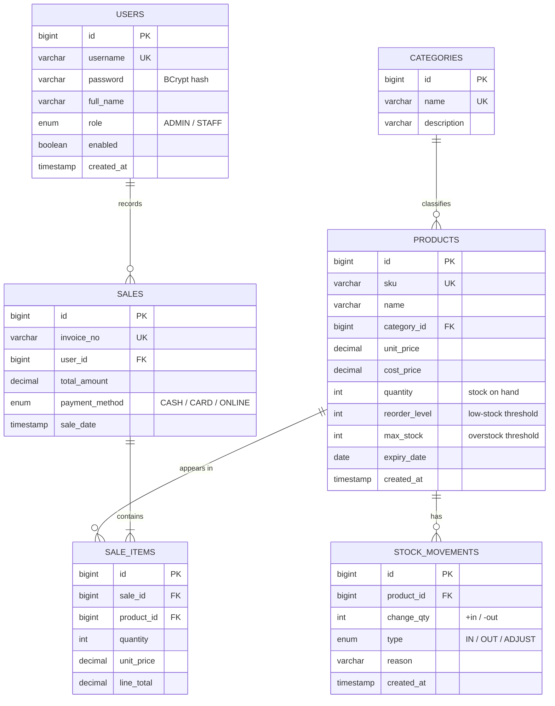

# Entity Relationship Diagram

The database (`smart_inventory`) has six tables. Diagram in Mermaid — it renders
on GitHub and in most Markdown viewers.

## Relationships

| Relationship | Type | Meaning |
|--------------|------|---------|
| Categories → Products | 1‑to‑many | A category groups many products |
| Products → Stock Movements | 1‑to‑many | Each stock change is logged per product |
| Products → Sale Items | 1‑to‑many | A product can appear in many sale lines |
| Sales → Sale Items | 1‑to‑many | An invoice has one or more line items |
| Users → Sales | 1‑to‑many | The staff/admin who recorded the sale |

## Notes
- `products.quantity` is the live stock level; every change is mirrored in
  `stock_movements` to preserve a full audit trail and historical demand.
- `sale_items` is the fact table the AI service reads for demand, trend and
  movement analysis.
